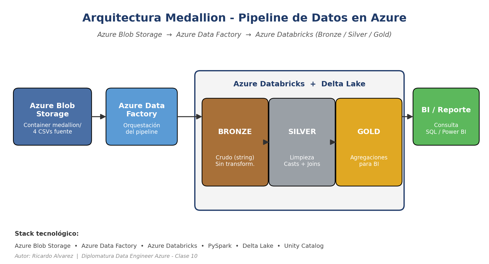

# Pipeline de Datos — Arquitectura Medallion en Azure



## Descripción del proyecto

Pipeline de datos end-to-end que ingesta archivos CSV de ventas diarias desde Azure Blob Storage, los procesa en Azure Databricks aplicando la arquitectura **Medallion** (Bronze / Silver / Gold) sobre Delta Lake, y los deja listos para analítica de negocio (ranking de productos, ventas por categoría y ventas por fecha y tienda). El objetivo es transformar archivos crudos heterogéneos en tablas confiables y agregadas, consultables vía SQL y conectables a herramientas de BI.

## Tecnologías utilizadas

- **Azure Blob Storage** — almacenamiento de archivos fuente (4 CSVs).
- **Azure Data Factory** — orquestación del pipeline (preparado para ingesta programada).
- **Azure Databricks** — transformación y procesamiento distribuido.
- **Delta Lake** — formato de almacenamiento con soporte ACID, time travel y `MERGE INTO`.
- **PySpark** — procesamiento de datos a escala.
- **Unity Catalog** — gobierno de datos (managed tables, schemas, volumes).

## Arquitectura

El pipeline implementa la arquitectura Medallion de tres capas:

| Capa | Descripción |
|------|-------------|
| 🟤 **Bronze** | Ingesta de datos crudos desde CSV. Todas las columnas como `string`, sin transformaciones. Captura el dato tal cual llega. |
| ⚪ **Silver** | Limpieza (`dropna`, `dropDuplicates`), casts de tipos (`date`, `int`, `double`) y enriquecimiento con 3 joins (clientes, productos, tiendas). |
| 🟡 **Gold** | Agregaciones analíticas: ventas por fecha y tienda, ventas por categoría y top productos. Listas para BI. |

Cada capa es **idempotente** (escritura con `overwrite + overwriteSchema=true`) y se ejecuta como un notebook independiente, lo que permite re-procesar cualquier capa sin recrear las demás.

## Estructura del repositorio

```
pipeline-medallion-azure/
├── notebooks/
│   ├── 01_Bronze_Ingesta.ipynb
│   ├── 02_Silver_Limpieza_Enriquecimiento.ipynb
│   └── 03_Gold_Agregaciones.ipynb
├── data/
│   └── sample/
│       ├── clientes_sample.csv
│       ├── productos_sample.csv
│       ├── tiendas_sample.csv
│       └── ventas_diarias_sample.csv
├── docs/
│   └── documento_funcional.md
├── architecture.png
├── .gitignore
└── README.md
```

## Validaciones implementadas

El notebook Silver implementa un sistema de calidad de datos con las siguientes reglas:

1. **Eliminación de nulos**: `dropna()` descarta filas con cualquier campo nulo en la tabla de hechos `ventas_diarias`. Esto evita arrastrar registros incompletos a Silver y Gold.
2. **Deduplicación por clave de negocio**: `dropDuplicates(["fecha", "tienda_id", "producto_id", "cliente_id"])` elimina ventas duplicadas que pudieran haber llegado por reintentos o cargas repetidas.
3. **Casts de tipo explícitos**: `fecha → date`, `cantidad → int`, `precio_unitario → double`. Cualquier valor que no pueda convertirse queda como `null` y es detectable con un `SELECT count(*) WHERE col IS NULL`.
4. **Joins de integridad referencial** (inner joins): las ventas que apuntan a un `cliente_id`, `producto_id` o `tienda_id` inexistente en las maestras quedan automáticamente fuera de Silver. Esto garantiza que el dataset Gold solo contenga ventas con dimensiones consistentes.
5. **Limpieza de colisión de columnas**: se descarta `ciudad` de la maestra de clientes antes del join para evitar ambigüedad con `ciudad` de tiendas.

Tratamiento de errores: las escrituras Delta usan `mode("overwrite").option("overwriteSchema", "true")`, por lo que cada ejecución es reproducible y un cambio de schema no rompe el pipeline. Los notebooks pueden re-ejecutarse en cualquier orden a partir de Bronze sin estado intermedio.

## Resultados

> *[CAPTURA: tabla `gold_top_productos` — ranking por total_ventas]*

> *[CAPTURA: tabla `gold_ventas_por_categoria` — total_unidades y total_ventas por categoría]*

> *[CAPTURA: tabla `gold_ventas_por_tienda` — granularidad diaria por punto de venta]*

> *[CAPTURA: salida del `DESCRIBE HISTORY` mostrando las versiones Delta]*

## Cómo configurar el proyecto

1. **Clona el repositorio**
   ```bash
   git clone https://github.com/<tu-usuario>/pipeline-medallion-azure.git
   ```

2. **Crea un Storage Account y un container en Azure**
   - Storage Account: `stdiploventas` (o el nombre que prefieras).
   - Container: `medallion`.
   - Subí los 4 CSVs de `data/sample/` (o tus propios datos con el mismo schema).

3. **Levanta un workspace de Azure Databricks** con Unity Catalog habilitado y crea (o reutiliza) un Volume para escribir las tablas Delta. En este proyecto se usa `/Volumes/dbx_diplo_ricardo/default/clase8/clase10`.

4. **Configura la Access Key** en el notebook `01_Bronze_Ingesta.ipynb`: reemplazá `TU_KEY_AQUI` por la Access Key 1 de tu Storage Account (88 caracteres terminados en `==`). **No subas la key real al repositorio.**

5. **Ejecutá los notebooks en orden**:
   1. `01_Bronze_Ingesta.ipynb` → lee CSV desde Blob, escribe Delta en Bronze.
   2. `02_Silver_Limpieza_Enriquecimiento.ipynb` → limpia y enriquece con joins.
   3. `03_Gold_Agregaciones.ipynb` → genera las 3 tablas analíticas.

6. **Consultá los resultados** desde el Catalog Explorer de Databricks o vía SQL:
   ```sql
   SELECT * FROM dbx_diplo_ricardo.gold_clase10.gold_top_productos LIMIT 10;
   ```

## Autor

**Ricardo Alvarez**

linkedin.com/in/ricardo-andres-alvarez · ricardoalvarez913@gmail.com
Proyecto desarrollado como parte de la Diplomatura de Data Engineer en Azure.
